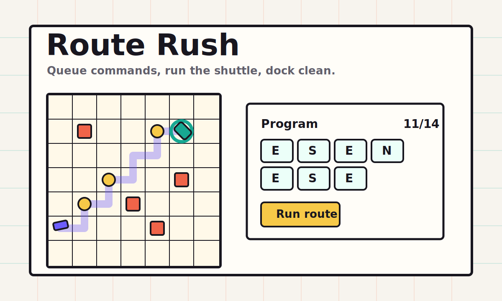

# Route Rush

Route Rush is a tiny daily browser puzzle where you queue a shuttle route, run the program once, and try to dock with every spark collected.

[Play the live demo](https://bte808.github.io/fun-20260603-a-route-rush/)



## What it does

- Generates a deterministic daily 7x7 route puzzle from the challenge date.
- Lets players queue north, east, south, and west commands before the shuttle moves.
- Replays the route, shows crashes or clean docks, scores the run, and stores a local best.
- Produces a short share result for the day.

## Why it is useful

It is a lightweight programming-puzzle toy that turns planning, debugging, and pathfinding into a one-minute browser challenge. It works without installs, accounts, network calls, or build tooling.

## Why it is fun

The board is readable at a glance, but the score pushes you to collect every spark and avoid wasted moves. Because the puzzle is date-seeded, everyone can compare the same route on the same day.

## Why it may be worth starring

- No dependencies: easy to fork, audit, remix, and host on GitHub Pages.
- Daily challenge loop: one clear reason to come back or share a score.
- Small codebase: core generation and scoring live in a pure module with tests.
- Browser-first polish: responsive layout, local best score, share text, and deterministic smoke hooks.

## Core play

1. Pick direction commands in the Program panel.
2. Run the route.
3. Adjust the queue until the shuttle docks and collects all sparks.
4. Copy the result for the daily challenge.

## How to run

```bash
npm test
npm run serve
```

Then open:

```text
http://localhost:5223/index.html?date=2026-06-03
```

For a browser smoke test with local Chrome:

```bash
npm run verify:browser
```

## Validation

- `npm test` checks required files, README coverage, deterministic daily generation, scoring, share text, and mobile CSS guardrails.
- `npm run verify:browser` opens the app in headless Chrome, checks desktop and 390x844 mobile layouts, queues commands, solves the daily route, and verifies the share result.

## Inspiration sources

This project borrows only the broad idea shape from public inspiration: daily browser puzzles, instantly playable web toys, and low-friction static games. No code, assets, copy, puzzle data, or protected design work was copied.

- [Hacker News Show HN](https://news.ycombinator.com/show)
- [GitHub Trending JavaScript](https://github.com/trending/javascript?since=daily)
- [Product Hunt games](https://www.producthunt.com/categories/games)

## Future ideas

- Add a daily leaderboard-free replay card image.
- Add optional loop commands for harder routes.
- Add route import/export strings for custom challenges.
- Add a compact PWA install manifest.

## License

MIT
